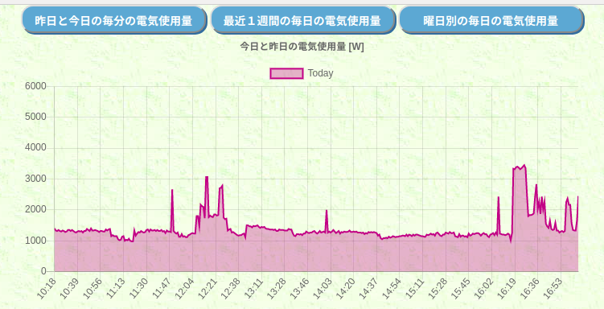
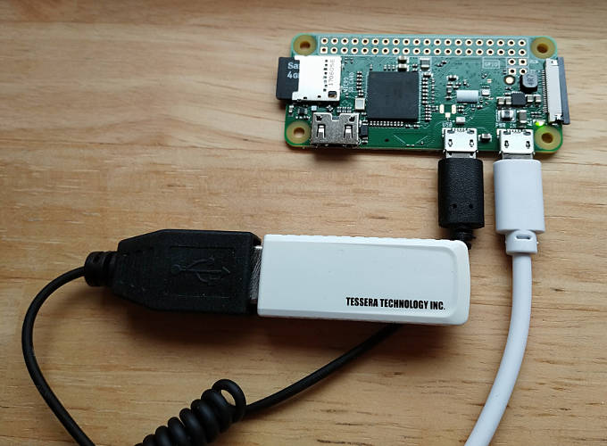

# denki-monitor / 電気使用量モニター

Monitor power usage  
Use Raspberry Pi to record electricity usage and display it on a web browser.

ラズベリーパイを使って、電気使用量を記録、Webブラウザ上でグラフ表示するシステムです。

## Description

電力自由化にともない、スマートメーターへの置き換えが進んでいます。  
スマートメーターから、リアルタイムでの現在の電力使用量や積算の電気使用量などの情報を得ることができます。  
本システムでは、リアルタイムの瞬時使用電力を随時データベースに格納し、
Webブラウザからの問い合わせに対し、最近の電気使用量をグラフ化して応答します。

## Demo
サンプル画面：今日の電気使用量グラフ

## Requirement

### Hardware
- Raspberry Pi Zero W  
    シングルボードコンピュータです。  
    WifiやBluetoothの通信機能も搭載されています。  
    LinuxベースのRasbpian OS。とても使いやすい。約2千円  
- RL7023 Stick-D/IPS  
    https://www.tessera.co.jp/rl7023stick-d_ips.html  
    HEMS用 Wi-SUNモジュール, Wi-SUN Route-B 専用  
    スマートメーターと通信するためのモジュールです。約1万円  

### Software / Framework
- OS: Rasbpian Stretch
- DataBase: psql (PostgreSQL) 9.6.13
- Language: Python 2.7.13
- Packeges: python-dev, libpq-dev, python-psycopg2, python-pip, 
- WebFramework: Flask

## Usage

## Install

## Contribution

## Licence

## Author

Shimazaki Katsuhito

### Reference

- ECHONETのホームページ および 規格書  
https://echonet.jp/  
https://echonet.jp/spec_object_rh/  

- スマートメーターの情報を最安ハードウェアで引っこ抜く  
https://qiita.com/rukihena/items/82266ed3a43e4b652adb
